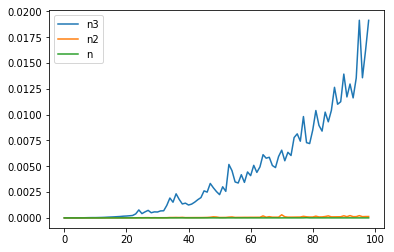
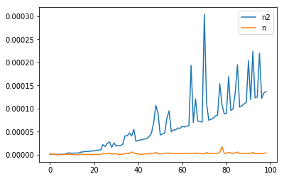

### Questions
* the section seems a little off track
    * hard to put things together on how it's used

### Objectives
YWBAT 
* define a complete graph
* give examples of when to use graph theory
* how is graph theory used today
* calculate big O for various algorithms
* create functions with a specific big O value


#### What is big O Notation
* a way of showing the number of FLOPS required for a function/code block

#### Why big O?
* graphs get massive...like super large...like huge
    * building fast/efficient algorithms around them is crucial

### Why is calculating/estimating edge numbers so important for computational studies?
How many flops your code is going to do

**flops** -> number of floating point operations per second -> algorithm efficiency

**Big O** Notation
* O(1) - constant time

**Example**
```
def big_o_one():
    """
    Number of flops: 1
    """
    return 2
    
def big_o_one(a, b):
    """
    Number of flops: 1
    """
    return a + b

print(big_o_one())
print(big_o_one())
```


* O(n) - linear time

**Example**

```
def big_o_n(array):
    """
    Number of flops: len(array)
    """
    new_array = []
    for a in array:
        new_array.append(a + 1)
    return new_array
```


* O(nlogn) - n-logn time 

[algorithm here](https://adrianmejia.com/most-popular-algorithms-time-complexity-every-programmer-should-know-free-online-tutorial-course/#Binary-search)

```
binary search algorithm
heapsort
mergesort
quicksort

```

* O(n^2) - n^2 time

**Example**
```
def big_o_n_squared(array):
    """
    Number of flops: n^2 -> len(array)*len(array)
    """
    products = []
    for i in array:
        for j in array:
            products.append(i * j)
    return products   
```


* O(n^3) - n^3 time

**Example**

```
def big_o_n_cubed(array):
    """
    Number of flops: n^3 -> 
    """
    products = []
    for i in array:
       for j in array:
           for k in array:
               products.append(i*j*k)
    return products
```


```python
# Example of O(1)
def first(arr):
    return arr[0] + arr[1]


# Big(O) = n
def cap(arr): # arr has length n then this has n FLOPS
    cap_arr = []
    for word in arr:
        cap_arr.append(word.capitalize())
    return cap_arr


# Big(0) = O(cap_back) = n (Ex: 10n ~ n)
# flops = 2n
def cap_back(arr):
    cap_back_arr = []
    
    for word in arr:
        cap_back_arr.append(word[::-1])
    
    for index, word in enumerate(cap_back_arr):
        cap_back_arr[index] = word.capitalize()
    
    return cap_back_arr


# O(n^2)
def f(arr): # if len(arr) == 5 then FLOPS = 25
    f = []
    for word1 in arr: # 5 flops
        for word2 in arr: # 5 flops for every flop above , 5x5 -> 25
            if word1 == word2:
                continue
            if word1[0] == word2[0]:
                f.append((word1, word2))
    return f


# how could we write an 0(n^3)
def f3(arr): # if len(arr) == 5 then FLOPS = 125
    f = []
    for word1 in arr:
        for word2 in arr:
            for word3 in arr:
                continue
                
    return f
```


```python
import time
time.time()
```


    1566934823.699763


```python
# O(n3)
def f3(arr):
    p = 1
    for i in arr:
        for i in arr:
            for i in arr:
                p = 2
    return None


# O(n2)
def f2(arr):
    p = 1
    for i in arr:
        for i in arr:
            p = 2
    return None

# O(n1)
def f1(arr):
    p = 1
    for i in arr:
        p = 2
    return None

# O(k) (constant)
def f0(arr):
    p = 1
    return None
```


```python
# This loop will run each function 1000 times and record the time it takes to run through them. 
# Each iteration will increase the array by 1 unit.
t1, t2, t3 = [], [], []

for i in range(1, 100):
    arr = list(range(i))
    
    # going through f1 (linear time)
    start = time.time()
    f1(arr)
    t1_ = time.time() - start
    
    t1.append(t1_)
    
    
    # going through f2 (squared time)
    start = time.time()
    f2(arr)
    t2_ = time.time() - start
    t2.append(t2_)
    
    
    # going through f3 (cubic time)
    start = time.time()
    f3(arr)
    t3_ = time.time() - start
    
    t3.append(t3_)
```


```python
# Let's graph the n, n^2 and n^3 functions on time
import matplotlib.pyplot as plt
plt.plot(range(len(t3)), t3, label='n3')
plt.plot(range(len(t2)), t2, label='n2')
plt.plot(range(len(t1)), t1, label='n')
plt.legend()
plt.show()
```





```python
# Let's just look at n, n2
plt.plot(range(len(t2)), t2, label='n2')
plt.plot(range(len(t1)), t1, label='n')
plt.legend()
plt.show()
```





### How are graphs used?
* Networks
    * Finding people really close together
        *  connect users on purchase history 
        *  connect user demographical 
* Recommender Systems
    * 1 graph (grid) of users
    * 1 graph (grid) of items/movies/songs
    * find similar users and find what 1 user likes and recommend to the other

* Neural Networks
    * Layers - nodes
    * Layers are connected by edges
    * Talk more later
    
* PGMs - Probabilistic Graphical Models
    * super super fast compared to ML models
    * Markov Chains
        * connect items based on frequency
    * PGMs are really defined by the edges they use
        * Using Poisson Distributions
        * Normal Distribution
        * Beta Distribution

### Outline


```python
import pandas as pd
import numpy as np

import matplotlib.pyplot as plt
```

### Assessment
* creativity in coding is very useful to DS
* basics of bigO notation and the importance of avoiding nested for loops


```python

```
